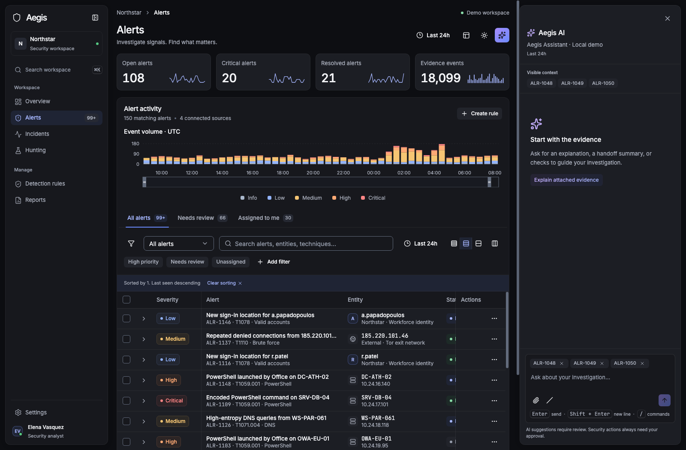

# Aegis

[Live Storybook](https://dimitriszoitas.github.io/aegis-ui/) · [Full DataGrid presentation](https://dimitriszoitas.github.io/aegis-ui/?path=/story/components-data-datagrid--full-presentation) · [SIEM console](https://dimitriszoitas.github.io/aegis-ui/?path=/story/console-siem-console--alerts)

Aegis is a token-based React design system for security operations, with independent light/dark color and Floating/Fixed layout themes, dense investigation tools, and AI assistance that keeps the analyst in control.

Storybook is the component reference and consumption guide. The repository also runs a complete SIEM console in Vite. This version is source-first: it has no published npm package, library bundle, or package exports map.



Compare layouts: [Floating · Light](docs/images/console-light.png) · [Floating · Dark](docs/images/console-dark.png) · [Fixed · Light](docs/images/console-fixed-light.png) · [Fixed · Dark](docs/images/console-fixed-dark.png).

## Explore the system

Start with **Foundations → Principles**, then open **Console → SIEM console → Alerts**. The console includes:

- Collapsible navigation in Floating or Fixed layout, with working Overview, Alerts, Incidents, Hunting, Detection rules, Reports, and Settings views.
- An alerts grid with sorting and multi-sort, constrained column resizing, visibility settings, three densities, selection, bulk actions, nested evidence, and a virtualized large-data example.
- A filter bar and left push panel backed by the same filter state, plus time ranges and severity histograms.
- Alert detail sheets with filtered-list navigation, evidence JSON, detection-rule YAML, activity timelines, and editable status, assignee, and analyst notes.
- A docked assistant with attached context, streaming, stop, retry, regenerate, feedback, and evidence navigation.
- A detection-rule wizard with horizontal and vertical layouts, inline suggestions, YAML review, sample replay, explicit approval, and an approval audit line.

For a complete table demonstration, open **Components → Data → DataGrid → Full presentation**. It combines synchronized filters, search, saved views, density and column controls, sorting and resizing, selection and bulk changes, evidence expansion, editable details, and AI summaries. Presentation controls switch between 150 and 1,000 records, pagination and virtual scrolling, and loading, empty, or retryable error states.

All records are synthetic. The default fixture has 150 alerts generated with a fixed seed and an October 6, 2026 reference clock. AI responses run locally without API keys or model requests. Console edits live in memory and reset on reload; the standalone playground remembers color and layout preferences.

The wizard's replay evaluates eight labeled Windows process events using a deliberately limited Sigma-style subset. Unsupported conditions and log sources produce an explicit error. Connect a production rule engine through the host application before using it for operational validation.

## Run locally

Use Node.js 24, matching the deployment workflow. The checkout was verified on Node.js 24.1.0; the complete toolchain also supports Node.js 22.13 or later in the 22.x line. The package manager is pinned to `pnpm@11.19.0` in `package.json`.

```sh
pnpm install
pnpm storybook
```

Open [local Storybook](http://localhost:6006). Separate toolbar choices control light/dark color and Floating/Fixed layout. Floating is the default. Console examples with an open assistant show each layout in either color theme. To run the standalone console instead:

```sh
pnpm dev
```

Use the local URL printed by Vite. No environment variables, credentials, or external services are required.

## Design principles

**Two workspace layouts.** Floating keeps navigation and sheets 12px from the viewport with 12px outer corners and layered shadows; the compact navigation rail uses 8px corners. Fixed places full-height navigation and assistant chrome flush against the workspace edges, with dividers, square outer corners, and no chrome shadow. Both layouts use the same colors, typography, controls, cards, and data. Navigation remains 240px expanded or 48px collapsed, with 12px expanded padding and 12px vertical/6px horizontal collapsed padding. Its toggle stays at the top.

Selected navigation items use a soft accent fill with accent text and icons, without an item border or shadow. The same treatment applies in the compact rail and nested navigation.

**Corners stay compact.** Small, medium, and large controls are 28/34/40px high with 6/7/8px corners. Surfaces use 10px standard corners, 12px large/floating corners, and 8px nested corners. The nested token subtracts the shared 4px step from the 12px parent radius. Chips and badges use rounded rectangular shapes with 6px corners; checkboxes keep 4px corners. Line and dot separators each offer normal and light emphasis.

**Overflow stays usable.** Pages, tables, editors, and panels share slim, theme-aware native scrollbars, with stronger thumb colors on hover and drag. Keyboard, wheel, and touch scrolling stay native; forced-colors mode keeps system styling.

**Hierarchy stays clear.** Accordion bodies, navigation children, tree levels, JSON branches, and expanded table content use a shared 12px inset.

**Color has a purpose.** Function blue identifies primary actions; the AI intent carries a violet-to-blue gradient through filled, soft, and foreground treatments. Destructive, success, and warning colors are separate from the five-level severity scale. Labels and icons preserve meaning without color.

**Density preserves access.** Grid rows are 36px compact, 48px default, and 60px comfortable. Long alert titles stay on one line with full-text tooltips and accessible row labels. Compact metadata fits the row height. Density never removes investigation actions.

From the first scroll on every console page, compact breadcrumbs and the same actions stay pinned while the title continues underneath.

**AI remains reviewable.** Generated output has a visible label and provenance. Each turn snapshots its supplied context; stopping preserves partial output, and regenerating uses that original snapshot. Late output from superseded requests is ignored. Proposed detection changes require explicit approval, and security actions are never performed by the mock.

## Tokens and themes

The token system has three layers:

1. Primitives: color ramps, spacing, type, radii, and motion scales.
2. Semantic tokens: surfaces, text, borders, intent, severity, syntax, charts, and focus.
3. Component tokens: control radii, sidebar dimensions, and grid densities.

[`src/styles/tokens.css`](src/styles/tokens.css) is the color source of truth. [`theme.css`](src/styles/theme.css) maps tokens into Tailwind v4 and bridges shadcn variables; [`globals.css`](src/styles/globals.css) loads self-hosted Inter and JetBrains Mono and common styles. Components consume tokens rather than raw colors. Foundation swatches read the token source directly.

Control primitives retain 6px (`xs` and `sm`), 7px (`md`), and 8px (`lg`, `xl`, and `2xl`). The legacy `--radius-full` stays 8px and chips use the dedicated 6px `--chip-radius`. Surface tokens are separate: `--surface-radius` is 10px, `--surface-radius-floating` is 12px, and `--surface-radius-nested` is `calc(var(--surface-radius-floating) - var(--space-1))`, or 8px. Nested surface rules never change control corners.

The theme is reflected by `.dark` and `data-theme` on `<html>`. [`useTheme`](src/lib/theme.ts) supports `light`, `dark`, and `system`, follows system changes, and persists explicit preferences when storage is available. The independent layout axis uses `data-layout-theme` with `floating` or `fixed`; [`applyLayoutTheme`](src/lib/layout-theme.ts) applies it to the document for portaled sheets and menus. Storybook's two toolbar controls preview every color/layout combination without persisting a standalone preference.

For a source-level integration, import the global stylesheet once and compose the components from their folders:

```tsx
import '@/styles/globals.css';
import { Button } from '@/components/button';
import { Sparkles } from 'lucide-react';

export function ExplainAction({ onExplain }: { onExplain: () => void }) {
  return (
    <Button intent="ai" leadingIcon={<Sparkles size={16} />} onClick={onExplain}>
      Explain this alert
    </Button>
  );
}
```

The `@/` alias resolves to `src/` in this repository. Each folder exports its public components and prop types. Use Storybook's component docs for individual APIs. Complex patterns expose controlled state and callbacks so a host application owns persistence and navigation; for example, `AlertDetailSheet` uses the canonical alert record alongside a separate filtered navigation list, and `AiPanel` accepts a keyed request and an evidence callback.

## Keyboard behavior

| Surface                  | Interaction                                                                                                            |
| ------------------------ | ---------------------------------------------------------------------------------------------------------------------- |
| Menus, selects, and tabs | Arrow navigation; Escape dismisses overlays; Tab leaves menus.                                                         |
| Trees and JSON           | Arrow keys traverse visible nodes; Left/Right collapse and expand. JSON supports copy value and path actions.          |
| Data grid                | Up/Down move row focus; Enter opens a row; Shift-click adds a sort; focused resize handles support arrow keys.         |
| Dialogs and sheets       | Modal focus stays inside the overlay and returns on close. Docked panels keep the workspace accessible.                |
| Assistant composer       | Enter sends; Shift+Enter inserts a newline; `/` opens commands; Stop preserves the current response.                   |
| Code editor              | Tab and Shift+Tab leave the editor rather than trapping focus.                                                         |
| Rule wizard              | Arrow navigation follows the stepper orientation; completed steps can be revisited; validation gates forward progress. |

All interactive controls use visible token-based focus styling. Reduced-motion preferences suppress decorative animation, including loading shimmer and AI streaming effects.

## Development and verification

| Command                | Purpose                                                                                                     |
| ---------------------- | ----------------------------------------------------------------------------------------------------------- |
| `pnpm dev`             | Run the standalone SIEM console.                                                                            |
| `pnpm build`           | Type-check and build the console into `dist/`.                                                              |
| `pnpm preview`         | Preview that console build.                                                                                 |
| `pnpm storybook`       | Run Storybook on port 6006.                                                                                 |
| `pnpm build-storybook` | Build documentation into `storybook-static/`.                                                               |
| `pnpm typecheck`       | Check strict TypeScript types.                                                                              |
| `pnpm lint`            | Run ESLint and the raw-hex color guard.                                                                     |
| `pnpm test`            | Run 15 focused Vitest tests for tree selection, filters, time ranges, and table helpers.                    |
| `pnpm test:stories`    | Run every story and its play function in light/dark Chromium, collecting browser errors and axe violations. |
| `pnpm check`           | Run types, lint, logic tests, and the Storybook build.                                                      |
| `pnpm format`          | Format the repository with Prettier.                                                                        |

Browser checks require Chromium and a running Storybook:

```sh
pnpm exec playwright install chromium
pnpm storybook
# In a second terminal:
pnpm test:stories
```

`STORYBOOK_URL` selects another running Storybook, and `STORY_FILTER` limits stories by ID using a regular expression. `CAPTURE_STORIES=1` also saves screenshots. Results go into ignored `test-results/`. The story sweep covers rendered story states and their play interactions; foundation MDX pages and additional keyboard workflows are reviewed separately. These checks support accessibility review and do not replace it.

When adding a component, export its typed API, use semantic tokens, add a colocated story matrix and focused interaction states, and verify both themes. Use realistic investigation content. Keep raw color values in `tokens.css`.

## Repository map

```text
.storybook/                 Preview, themes, docs, and accessibility configuration
src/styles/                 Primitive, semantic, and component tokens
src/components/             Reusable controls, surfaces, data display, and AI components
src/patterns/               Filters, wizard, assistant, detail sheet, and SIEM console
src/sample-data/            Seeded alerts, rules, analysts, and time series
src/stories/foundations/    Token specimens and design guidelines
src/lib/                   State helpers, theme utilities, and local AI protocol
scripts/                   Token guard and browser story verification
```

The implementation uses React, TypeScript, Vite, Tailwind v4, Radix/shadcn foundations, TanStack Table and Virtual, CodeMirror 6, Recharts, cmdk, react-day-picker, react-resizable-panels, and Sonner. Fonts are bundled locally; no external font CDN is needed.

## Roadmap

- Package a reusable library build with a typed exports map and a documented release process. npm publishing is a later milestone.
- Add maintained visual-regression baselines alongside the existing themed story and interaction checks.
- Connect host-owned data and AI adapters while preserving controlled APIs, evidence provenance, cancellation, and explicit approval.

Licensed under the [MIT license](LICENSE).
